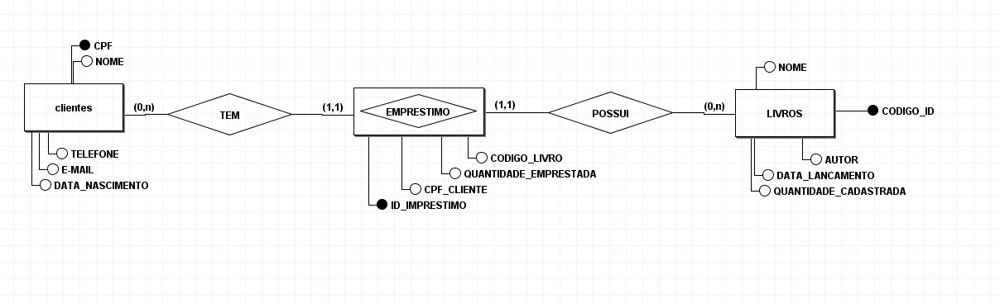
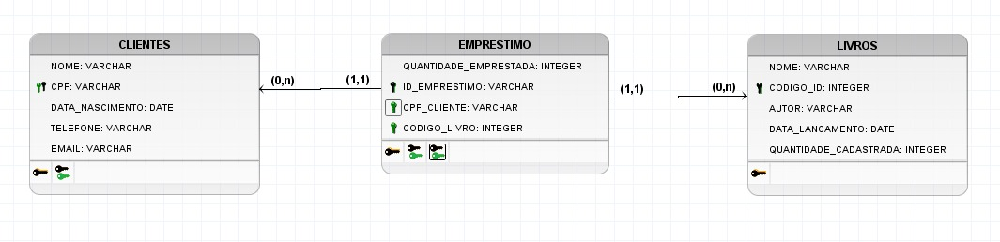

# 🗄️ Banco de Dados — Sistema de Biblioteca

Projeto de banco de dados desenvolvido em **PostgreSQL**, com o objetivo de praticar criação de tabelas, relacionamentos, chaves primárias, chaves estrangeiras e consultas SQL.

## 🛠️ Tecnologias

* PostgreSQL
* SQL
* pgAdmin 4
* BRModelo

## 📐 Modelagem

### Modelo Conceitual

Representação das entidades e seus relacionamentos.



### Modelo Lógico

Representação das tabelas, atributos, chaves primárias e chaves estrangeiras.



## 🗂️ Estrutura do Banco

O banco de dados é composto pelas seguintes tabelas:

### `CLIENTES`

Armazena os dados dos clientes da biblioteca.

Principais campos:

* `cpf` — chave primária
* `nome`
* `datanascimento`
* `telefone`
* `email`

### `LIVROS`

Armazena os livros disponíveis na biblioteca.

Principais campos:

* `id` — chave primária
* `nome`
* `autor`
* `datalancamento`
* `quantidade_cadastrada`

### `EMPRESTIMO`

Registra os empréstimos realizados.

Principais campos:

* `id_emprestimo` — chave primária
* `cpf_cliente` — chave estrangeira
* `id_livro` — chave estrangeira

## 🔗 Relacionamentos

```text
CLIENTES
   │
   │ 1:N
   ▼
EMPRESTIMO
   ▲
   │ N:1
   │
LIVROS
```

A tabela `EMPRESTIMO` utiliza chaves estrangeiras para relacionar os clientes e os livros.

```sql
FOREIGN KEY (cpf_cliente)
REFERENCES CLIENTES(cpf);

FOREIGN KEY (id_livro)
REFERENCES LIVROS(id);
```

## 📄 Script SQL

O script responsável pela criação do banco está disponível em:

```text
sql/biblioteca.sql
```

O arquivo contém os comandos SQL utilizados para criação das tabelas e seus relacionamentos.

## 🎯 Objetivo

Este projeto foi desenvolvido para praticar:

* Criação de bancos de dados
* Criação e alteração de tabelas
* `PRIMARY KEY`
* `FOREIGN KEY`
* `NOT NULL`
* `SERIAL`
* Relacionamentos entre tabelas
* `INSERT`
* `SELECT`
* `UPDATE`
* `DELETE`
* Consultas SQL
* Modelagem conceitual e lógica

---

### 👨‍💻 Autor

**Eduardo Silva**

Projeto desenvolvido para fins de estudo e portfólio.

